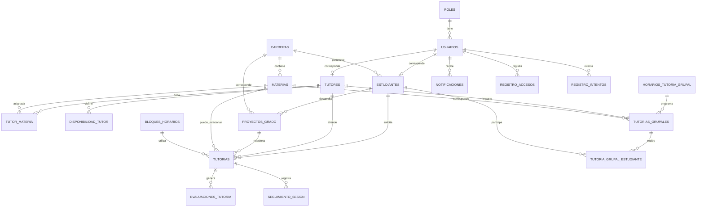

# Diagrama general del modelo de datos


```mermaid
erDiagram
    ROLES ||--o{ USUARIOS : tiene
    USUARIOS ||--o| ESTUDIANTES : corresponde
    USUARIOS ||--o| TUTORES : corresponde
    CARRERAS ||--o{ ESTUDIANTES : pertenece
    CARRERAS ||--o{ MATERIAS : contiene
    TUTORES ||--o{ TUTOR_MATERIA : dicta
    MATERIAS ||--o{ TUTOR_MATERIA : asignada
    TUTORES ||--o{ DISPONIBILIDAD_TUTOR : define
    ESTUDIANTES ||--o{ PROYECTOS_GRADO : desarrolla
    CARRERAS ||--o{ PROYECTOS_GRADO : corresponde
    ESTUDIANTES ||--o{ TUTORIAS : solicita
    TUTORES ||--o{ TUTORIAS : atiende
    PROYECTOS_GRADO ||--o{ TUTORIAS : relaciona
    MATERIAS ||--o{ TUTORIAS : puede_relacionar
    BLOQUES_HORARIOS ||--o{ TUTORIAS : utiliza
    HORARIOS_TUTORIA_GRUPAL ||--o{ TUTORIAS_GRUPALES : programa
    TUTORES ||--o{ TUTORIAS_GRUPALES : imparte
    MATERIAS ||--o{ TUTORIAS_GRUPALES : corresponde
    TUTORIAS_GRUPALES ||--o{ TUTORIA_GRUPAL_ESTUDIANTE : recibe
    ESTUDIANTES ||--o{ TUTORIA_GRUPAL_ESTUDIANTE : participa
    TUTORIAS ||--o{ EVALUACIONES_TUTORIA : genera
    TUTORIAS ||--o{ SEGUIMIENTO_SESION : registra
    USUARIOS ||--o{ NOTIFICACIONES : recibe
    USUARIOS ||--o{ REGISTRO_ACCESOS : registra
    USUARIOS ||--o{ REGISTRO_INTENTOS : intenta
```

## Fuente

El modelo corresponde al esquema definitivo de:

```text
database/init.sql
```
